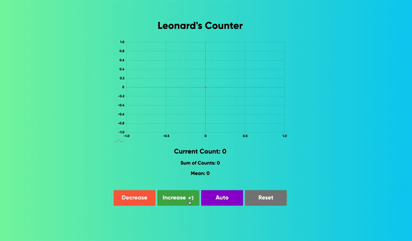

<h1 align="center">
  Fancy Counter
</h1>
<p align="center">
  A fancy counter made just for fun
</p>



## 👍 How to Use This Repository
The source code is free for you to use as reference or to build upon. Have fun!

## 🛠 Installation & Set Up

1. Install dependencies

   ```sh
   npm install
   ```

2. Start the development server

   ```sh
   npm start
   ```

## ❓ Additional Notes

This is used as a demonstration to how useState can be used to create a simple counter app
